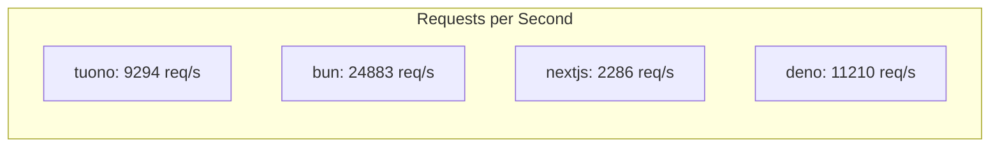

# Performance Benchmark Report

**Generated:** 12/6/2025, 1:40:59 PM

## 💻 System Information

> [!NOTE]
> Performance results are specific to this hardware configuration.

| Component | Details |
|-----------|----------|
| **Operating System** | Ubuntu 24.04.3 LTS |
| **Kernel** | 6.11.0-1018-azure |
| **CPU** | AMD EPYC 7763 64-Core Processor |
| **CPU Cores** | 4 |
| **Architecture** | x86_64 |
| **RAM** | 15.62 GB |
| **GPU** | Microsoft Corporation Hyper-V virtual VGA |

**Runtime Versions:**
- Node.js: v20.19.6
- Bun: 1.3.3
- Deno: 1.46.3
- Rust: 1.91.1

**Benchmark Timestamp:** Sat Dec  6 13:36:25 UTC 2025

---

## 📊 Summary

| Framework | Requests/sec | Avg Latency | Performance | Accessibility | SEO |
|-----------|--------------|-------------|-------------|---------------|-----|
| **tuono** | 9294.45 | 42.88ms | 85% | 59% | 67% |
| **bun** | 24882.98 | 15.90ms | N/A | N/A | N/A |
| **nextjs** | 2285.66 | 108.56ms | 99% | 100% | 100% |
| **deno** | 11209.64 | 34.75ms | 96% | 90% | 91% |

---

## TUONO

### HTTP Benchmarks (wrk)

| Metric | Value |
|--------|-------|
| Requests/sec | 9294.45 |
| Transfer/sec | 12.40MB |
| Avg Latency | 42.88ms |
| Max Latency |  |
| Total Requests | 279489 |
| Duration | 30.07s |
| Errors | 0 |

### Lighthouse Scores

| Category | Score |
|----------|-------|
| Performance | 85% |
| Accessibility | 59% |
| Best Practices | 93% |
| SEO | 67% |

### Core Web Vitals

| Metric | Value |
|--------|-------|
| First Contentful Paint | 3.2 s |
| Largest Contentful Paint | 3.4 s |
| Time to Interactive | 3.4 s |
| Total Blocking Time | 0 ms |
| Cumulative Layout Shift | 0 |

---

## BUN

### HTTP Benchmarks (wrk)

| Metric | Value |
|--------|-------|
| Requests/sec | 24882.98 |
| Transfer/sec | 3.37MB |
| Avg Latency | 15.90ms |
| Max Latency |  |
| Total Requests | 747208 |
| Duration | 30.03s |
| Errors | 747208 |

---

## NEXTJS

### HTTP Benchmarks (wrk)

| Metric | Value |
|--------|-------|
| Requests/sec | 2285.66 |
| Transfer/sec | 14.67MB |
| Avg Latency | 108.56ms |
| Max Latency |  |
| Total Requests | 68692 |
| Duration | 30.05s |
| Errors | 0 |

### Lighthouse Scores

| Category | Score |
|----------|-------|
| Performance | 99% |
| Accessibility | 100% |
| Best Practices | 100% |
| SEO | 100% |

### Core Web Vitals

| Metric | Value |
|--------|-------|
| First Contentful Paint | 1.5 s |
| Largest Contentful Paint | 1.9 s |
| Time to Interactive | 2.1 s |
| Total Blocking Time | 20 ms |
| Cumulative Layout Shift | 0.01 |

---

## DENO

### HTTP Benchmarks (wrk)

| Metric | Value |
|--------|-------|
| Requests/sec | 11209.64 |
| Transfer/sec | 11.93MB |
| Avg Latency | 34.75ms |
| Max Latency |  |
| Total Requests | 337270 |
| Duration | 30.09s |
| Errors | 0 |

### Lighthouse Scores

| Category | Score |
|----------|-------|
| Performance | 96% |
| Accessibility | 90% |
| Best Practices | 100% |
| SEO | 91% |

### Core Web Vitals

| Metric | Value |
|--------|-------|
| First Contentful Paint | 2.3 s |
| Largest Contentful Paint | 2.3 s |
| Time to Interactive | 2.3 s |
| Total Blocking Time | 0 ms |
| Cumulative Layout Shift | 0.01 |

---

## Performance Comparison

