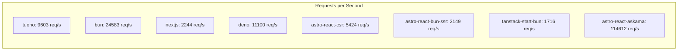

# Performance Benchmark Report

**Generated:** 12/7/2025, 4:37:50 AM

## 💻 System Information

> [!NOTE]
> Performance results are specific to this hardware configuration.

| Component | Details |
|-----------|----------|
| **Operating System** | Ubuntu 24.04.3 LTS |
| **Kernel** | 6.11.0-1018-azure |
| **CPU** | AMD EPYC 7763 64-Core Processor |
| **CPU Cores** | 4 |
| **Architecture** | x86_64 |
| **RAM** | 15.62 GB |
| **GPU** | Microsoft Corporation Hyper-V virtual VGA |

**Runtime Versions:**
- Node.js: v20.19.6
- Bun: 1.3.3
- Deno: 1.46.3
- Rust: 1.91.1

**Benchmark Timestamp:** Sun Dec  7 04:27:01 UTC 2025

---

## 📊 Summary

| Framework | Requests/sec | Avg Latency | Performance | Accessibility | SEO |
|-----------|--------------|-------------|-------------|---------------|-----|
| **astro-react-askama** | 114611.89 | 3.41ms | N/A | N/A | N/A |
| **bun** | 24583.23 | 16.10ms | N/A | N/A | N/A |
| **deno** | 11100.16 | 35.54ms | 99% | 90% | 91% |
| **tuono** | 9602.71 | 41.70ms | 94% | 59% | 67% |
| **astro-react-csr** | 5424.36 | 81.33ms | 99% | 100% | 100% |
| **nextjs** | 2244.23 | 109.31ms | 99% | 100% | 100% |
| **astro-react-bun-ssr** | 2149.39 | 183.42ms | 98% | 100% | 100% |
| **tanstack-start-bun** | 1715.73 | 230.39ms | 98% | 100% | 100% |

---

## TUONO

### HTTP Benchmarks (wrk)

| Metric | Value |
|--------|-------|
| Requests/sec | 9602.71 |
| Transfer/sec | 12.81MB |
| Avg Latency | 41.70ms |
| Max Latency |  |
| Total Requests | 288728 |
| Duration | 30.07s |
| Errors | 0 |

### Lighthouse Scores

| Category | Score |
|----------|-------|
| Performance | 94% |
| Accessibility | 59% |
| Best Practices | 93% |
| SEO | 67% |

### Core Web Vitals

| Metric | Value |
|--------|-------|
| First Contentful Paint | 2.4 s |
| Largest Contentful Paint | 2.5 s |
| Time to Interactive | 2.5 s |
| Total Blocking Time | 0 ms |
| Cumulative Layout Shift | 0.001 |

---

## BUN

### HTTP Benchmarks (wrk)

| Metric | Value |
|--------|-------|
| Requests/sec | 24583.23 |
| Transfer/sec | 3.33MB |
| Avg Latency | 16.10ms |
| Max Latency |  |
| Total Requests | 738063 |
| Duration | 30.02s |
| Errors | 738063 |

---

## NEXTJS

### HTTP Benchmarks (wrk)

| Metric | Value |
|--------|-------|
| Requests/sec | 2244.23 |
| Transfer/sec | 14.41MB |
| Avg Latency | 109.31ms |
| Max Latency |  |
| Total Requests | 67425 |
| Duration | 30.04s |
| Errors | 0 |

### Lighthouse Scores

| Category | Score |
|----------|-------|
| Performance | 99% |
| Accessibility | 100% |
| Best Practices | 100% |
| SEO | 100% |

### Core Web Vitals

| Metric | Value |
|--------|-------|
| First Contentful Paint | 1.6 s |
| Largest Contentful Paint | 1.9 s |
| Time to Interactive | 2.1 s |
| Total Blocking Time | 50 ms |
| Cumulative Layout Shift | 0.01 |

---

## DENO

### HTTP Benchmarks (wrk)

| Metric | Value |
|--------|-------|
| Requests/sec | 11100.16 |
| Transfer/sec | 11.81MB |
| Avg Latency | 35.54ms |
| Max Latency |  |
| Total Requests | 333610 |
| Duration | 30.05s |
| Errors | 0 |

### Lighthouse Scores

| Category | Score |
|----------|-------|
| Performance | 99% |
| Accessibility | 90% |
| Best Practices | 100% |
| SEO | 91% |

### Core Web Vitals

| Metric | Value |
|--------|-------|
| First Contentful Paint | 1.6 s |
| Largest Contentful Paint | 1.6 s |
| Time to Interactive | 1.6 s |
| Total Blocking Time | 0 ms |
| Cumulative Layout Shift | 0.01 |

---

## ASTRO-REACT-CSR

### HTTP Benchmarks (wrk)

| Metric | Value |
|--------|-------|
| Requests/sec | 5424.36 |
| Transfer/sec | 30.01MB |
| Avg Latency | 81.33ms |
| Max Latency |  |
| Total Requests | 162882 |
| Duration | 30.03s |
| Errors | 0 |

### Lighthouse Scores

| Category | Score |
|----------|-------|
| Performance | 99% |
| Accessibility | 100% |
| Best Practices | 100% |
| SEO | 100% |

### Core Web Vitals

| Metric | Value |
|--------|-------|
| First Contentful Paint | 1.4 s |
| Largest Contentful Paint | 1.7 s |
| Time to Interactive | 1.7 s |
| Total Blocking Time | 0 ms |
| Cumulative Layout Shift | 0.01 |

---

## ASTRO-REACT-BUN-SSR

### HTTP Benchmarks (wrk)

| Metric | Value |
|--------|-------|
| Requests/sec | 2149.39 |
| Transfer/sec | 13.06MB |
| Avg Latency | 183.42ms |
| Max Latency |  |
| Total Requests | 64584 |
| Duration | 30.05s |
| Errors | 0 |

### Lighthouse Scores

| Category | Score |
|----------|-------|
| Performance | 98% |
| Accessibility | 100% |
| Best Practices | 100% |
| SEO | 100% |

### Core Web Vitals

| Metric | Value |
|--------|-------|
| First Contentful Paint | 1.7 s |
| Largest Contentful Paint | 2.1 s |
| Time to Interactive | 2.1 s |
| Total Blocking Time | 0 ms |
| Cumulative Layout Shift | 0.01 |

---

## TANSTACK-START-BUN

### HTTP Benchmarks (wrk)

| Metric | Value |
|--------|-------|
| Requests/sec | 1715.73 |
| Transfer/sec | 7.37MB |
| Avg Latency | 230.39ms |
| Max Latency |  |
| Total Requests | 51560 |
| Duration | 30.05s |
| Errors | 0 |

### Lighthouse Scores

| Category | Score |
|----------|-------|
| Performance | 98% |
| Accessibility | 100% |
| Best Practices | 100% |
| SEO | 100% |

### Core Web Vitals

| Metric | Value |
|--------|-------|
| First Contentful Paint | 1.8 s |
| Largest Contentful Paint | 1.9 s |
| Time to Interactive | 1.9 s |
| Total Blocking Time | 0 ms |
| Cumulative Layout Shift | 0.016 |

---

## ASTRO-REACT-ASKAMA

### HTTP Benchmarks (wrk)

| Metric | Value |
|--------|-------|
| Requests/sec | 114611.89 |
| Transfer/sec | 68.42MB |
| Avg Latency | 3.41ms |
| Max Latency |  |
| Total Requests | 3449531 |
| Duration | 30.10s |
| Errors | 0 |

---

## Performance Comparison

