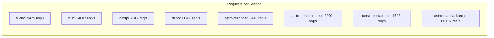

# Performance Benchmark Report

**Generated:** 12/7/2025, 7:28:12 AM

## 💻 System Information

> [!NOTE]
> Performance results are specific to this hardware configuration.

| Component | Details |
|-----------|----------|
| **Operating System** | Ubuntu 24.04.3 LTS |
| **Kernel** | 6.11.0-1018-azure |
| **CPU** | AMD EPYC 7763 64-Core Processor |
| **CPU Cores** | 4 |
| **Architecture** | x86_64 |
| **RAM** | 15.62 GB |
| **GPU** | Microsoft Corporation Hyper-V virtual VGA |

**Runtime Versions:**
- Node.js: v20.19.6
- Bun: 1.3.4
- Deno: 1.46.3
- Rust: 1.91.1

**Benchmark Timestamp:** Sun Dec  7 07:18:38 UTC 2025

---

## 📊 Summary

| Framework | Requests/sec | Avg Latency | Performance | Accessibility | SEO |
|-----------|--------------|-------------|-------------|---------------|-----|
| **astro-react-askama** | 111197.06 | 3.52ms | 100% | 100% | 100% |
| **bun** | 24807.48 | 15.95ms | N/A | N/A | N/A |
| **deno** | 11265.54 | 34.44ms | 99% | 90% | 91% |
| **tuono** | 9474.82 | 42.31ms | 95% | 59% | 67% |
| **astro-react-csr** | 5446.34 | 81.33ms | 99% | 100% | 100% |
| **nextjs** | 2311.67 | 107.83ms | 99% | 100% | 100% |
| **astro-react-bun-ssr** | 2200.09 | 179.44ms | 98% | 100% | 100% |
| **tanstack-start-bun** | 1721.87 | 229.02ms | 98% | 100% | 100% |

---

## TUONO

### HTTP Benchmarks (wrk)

| Metric | Value |
|--------|-------|
| Requests/sec | 9474.82 |
| Transfer/sec | 12.64MB |
| Avg Latency | 42.31ms |
| Max Latency |  |
| Total Requests | 284799 |
| Duration | 30.06s |
| Errors | 0 |

### Lighthouse Scores

| Category | Score |
|----------|-------|
| Performance | 95% |
| Accessibility | 59% |
| Best Practices | 93% |
| SEO | 67% |

### Core Web Vitals

| Metric | Value |
|--------|-------|
| First Contentful Paint | 2.4 s |
| Largest Contentful Paint | 2.4 s |
| Time to Interactive | 2.4 s |
| Total Blocking Time | 0 ms |
| Cumulative Layout Shift | 0.002 |

---

## BUN

### HTTP Benchmarks (wrk)

| Metric | Value |
|--------|-------|
| Requests/sec | 24807.48 |
| Transfer/sec | 3.36MB |
| Avg Latency | 15.95ms |
| Max Latency |  |
| Total Requests | 744949 |
| Duration | 30.03s |
| Errors | 744949 |

---

## NEXTJS

### HTTP Benchmarks (wrk)

| Metric | Value |
|--------|-------|
| Requests/sec | 2311.67 |
| Transfer/sec | 14.84MB |
| Avg Latency | 107.83ms |
| Max Latency |  |
| Total Requests | 69465 |
| Duration | 30.05s |
| Errors | 0 |

### Lighthouse Scores

| Category | Score |
|----------|-------|
| Performance | 99% |
| Accessibility | 100% |
| Best Practices | 100% |
| SEO | 100% |

### Core Web Vitals

| Metric | Value |
|--------|-------|
| First Contentful Paint | 1.6 s |
| Largest Contentful Paint | 1.9 s |
| Time to Interactive | 2.1 s |
| Total Blocking Time | 20 ms |
| Cumulative Layout Shift | 0.01 |

---

## DENO

### HTTP Benchmarks (wrk)

| Metric | Value |
|--------|-------|
| Requests/sec | 11265.54 |
| Transfer/sec | 11.99MB |
| Avg Latency | 34.44ms |
| Max Latency |  |
| Total Requests | 338648 |
| Duration | 30.06s |
| Errors | 0 |

### Lighthouse Scores

| Category | Score |
|----------|-------|
| Performance | 99% |
| Accessibility | 90% |
| Best Practices | 100% |
| SEO | 91% |

### Core Web Vitals

| Metric | Value |
|--------|-------|
| First Contentful Paint | 1.6 s |
| Largest Contentful Paint | 1.6 s |
| Time to Interactive | 1.6 s |
| Total Blocking Time | 0 ms |
| Cumulative Layout Shift | 0.01 |

---

## ASTRO-REACT-CSR

### HTTP Benchmarks (wrk)

| Metric | Value |
|--------|-------|
| Requests/sec | 5446.34 |
| Transfer/sec | 30.13MB |
| Avg Latency | 81.33ms |
| Max Latency |  |
| Total Requests | 163594 |
| Duration | 30.04s |
| Errors | 0 |

### Lighthouse Scores

| Category | Score |
|----------|-------|
| Performance | 99% |
| Accessibility | 100% |
| Best Practices | 100% |
| SEO | 100% |

### Core Web Vitals

| Metric | Value |
|--------|-------|
| First Contentful Paint | 1.4 s |
| Largest Contentful Paint | 1.7 s |
| Time to Interactive | 1.7 s |
| Total Blocking Time | 0 ms |
| Cumulative Layout Shift | 0.016 |

---

## ASTRO-REACT-BUN-SSR

### HTTP Benchmarks (wrk)

| Metric | Value |
|--------|-------|
| Requests/sec | 2200.09 |
| Transfer/sec | 13.37MB |
| Avg Latency | 179.44ms |
| Max Latency |  |
| Total Requests | 66149 |
| Duration | 30.07s |
| Errors | 0 |

### Lighthouse Scores

| Category | Score |
|----------|-------|
| Performance | 98% |
| Accessibility | 100% |
| Best Practices | 100% |
| SEO | 100% |

### Core Web Vitals

| Metric | Value |
|--------|-------|
| First Contentful Paint | 1.7 s |
| Largest Contentful Paint | 2.1 s |
| Time to Interactive | 2.1 s |
| Total Blocking Time | 0 ms |
| Cumulative Layout Shift | 0.01 |

---

## TANSTACK-START-BUN

### HTTP Benchmarks (wrk)

| Metric | Value |
|--------|-------|
| Requests/sec | 1721.87 |
| Transfer/sec | 7.39MB |
| Avg Latency | 229.02ms |
| Max Latency |  |
| Total Requests | 51736 |
| Duration | 30.05s |
| Errors | 0 |

### Lighthouse Scores

| Category | Score |
|----------|-------|
| Performance | 98% |
| Accessibility | 100% |
| Best Practices | 100% |
| SEO | 100% |

### Core Web Vitals

| Metric | Value |
|--------|-------|
| First Contentful Paint | 1.8 s |
| Largest Contentful Paint | 1.9 s |
| Time to Interactive | 2.2 s |
| Total Blocking Time | 0 ms |
| Cumulative Layout Shift | 0.016 |

---

## ASTRO-REACT-ASKAMA

### HTTP Benchmarks (wrk)

| Metric | Value |
|--------|-------|
| Requests/sec | 111197.06 |
| Transfer/sec | 144.01MB |
| Avg Latency | 3.52ms |
| Max Latency |  |
| Total Requests | 3346985 |
| Duration | 30.10s |
| Errors | 0 |

### Lighthouse Scores

| Category | Score |
|----------|-------|
| Performance | 100% |
| Accessibility | 100% |
| Best Practices | 96% |
| SEO | 100% |

### Core Web Vitals

| Metric | Value |
|--------|-------|
| First Contentful Paint | 1.5 s |
| Largest Contentful Paint | 1.5 s |
| Time to Interactive | 1.5 s |
| Total Blocking Time | 0 ms |
| Cumulative Layout Shift | 0 |

---

## Performance Comparison

